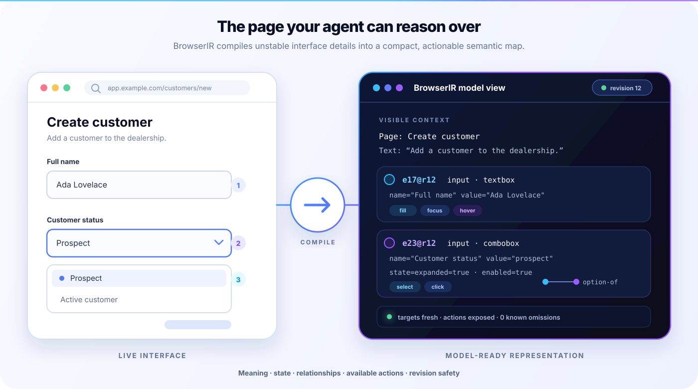
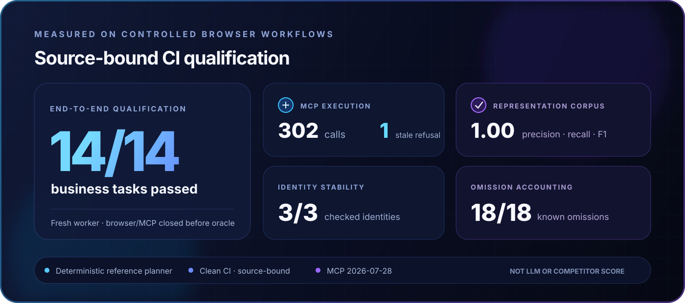
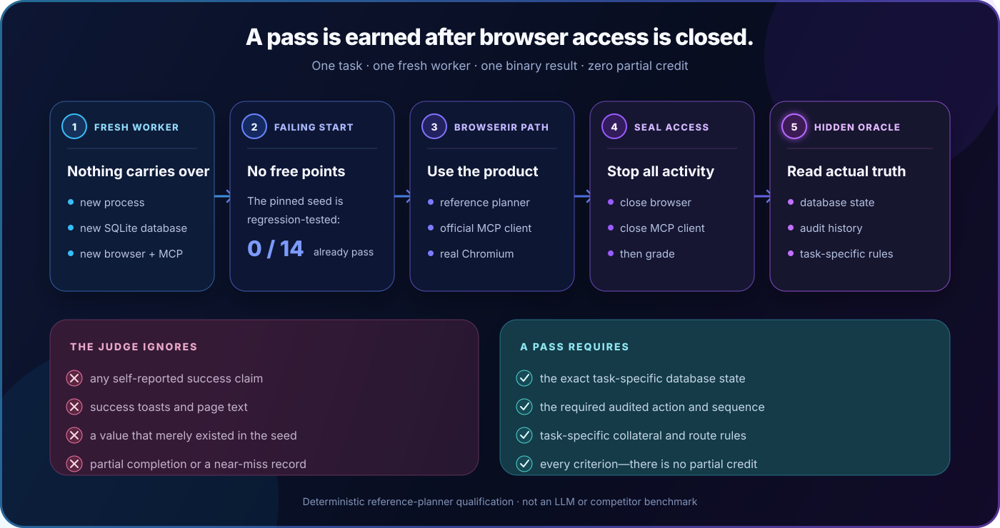
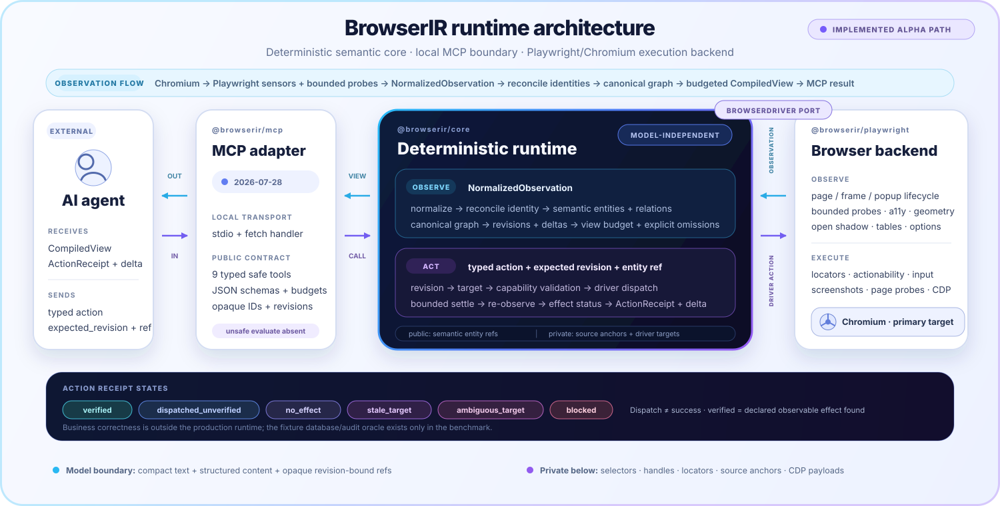

<h1 align="center">
  <picture>
    <source media="(prefers-color-scheme: dark)" srcset="assets/brand/browserir-wordmark-dark.svg">
    
  </picture>
</h1>

<p align="center"><strong>Give browser agents a map—not another DOM dump.</strong></p>

<p align="center">
  BrowserIR turns difficult live interfaces into compact semantic entities,<br>
  relationships, available actions, revisions, and effect-verification status.
</p>

<p align="center">
  <a href="https://github.com/qng95/BrowserIR/actions/workflows/ci.yml"></a>
  
  
  
  <a href="LICENSE"></a>
</p>

<p align="center">
  <a href="#see-what-the-model-sees"><strong>See the representation</strong></a>
  &nbsp;·&nbsp;
  <a href="#measured-on-real-browser-workflows"><strong>View the benchmark</strong></a>
  &nbsp;·&nbsp;
  <a href="#try-it-from-source"><strong>Try the alpha</strong></a>
</p>

<p align="center">
  <sub>14/14 was reproduced by a clean, source-bound GitHub Actions run on
  <a href="https://github.com/qng95/BrowserIR/actions/runs/31520630516"><code>0097f28</code></a>.
  It is deterministic system qualification—not an LLM or competitor score.</sub>
</p>

<p align="center">
  
</p>

---

> **Browser automation gives an agent hands. BrowserIR gives it a map.**

Playwright already knows how to click, type, scroll, and navigate. The harder
problem is deciding **what matters**, **what an element means**, **which action is
currently available**, and **whether the page changed underneath the agent**.

BrowserIR is that missing layer. It is designed to compile a live UI into the
simplest useful view for a model—but not a simpler one—then expose it as a
reusable TypeScript core and a local MCP server.

<table>
  <tr>
    <td width="33%" valign="top">
      <strong>Understand meaning</strong><br><br>
      Controls, labels, rows, options, containers, and business-visible
      relationships—not a bag of selectors.
    </td>
    <td width="33%" valign="top">
      <strong>Act with precision</strong><br><br>
      Actionable entities advertise current capabilities. Targets are revalidated
      and outcomes carry an explicit effect-verification status.
    </td>
    <td width="33%" valign="top">
      <strong>Survive change</strong><br><br>
      Revision-bound references, stable identity, deltas, and explicit omissions
      keep rerenders from becoming silent mistakes. Bounded continuation context
      keeps fresh next-action refs visible without repeating the full page.
    </td>
  </tr>
</table>

## See what the model sees

<p align="center">
  
</p>

The tested patterns behind the browser on the left include native inputs,
standards-hinted custom controls, open-shadow web components, and portal options
rendered elsewhere in the DOM. They converge on the same compact contract on the
right: **meaning, state, relationships, capabilities, and freshness**.

<details>
<summary><strong>Open an exact BrowserIR text view</strong></summary>

```text
Page: Technology-neutral choice
URL: data:[REDACTED]
Revision: 1
Visible text: "Customer Status"
[e6@r1] region role="main" name="Representation laboratory" state=visible=true
[e1@r1] input role="combobox" name="Customer Status" value="prospect" state=enabled=true,expanded=false,focused=false,visible=true actions=contextClick,focus,hover,select
[e2@r1] text role="label" text="Customer Status" state=visible=true
[e3@r1] option role="option" name="Active" value="active" state=enabled=true,selected=false,visible=false
[e4@r1] option role="option" name="Prospect" value="prospect" state=enabled=true,selected=true,visible=false
[e5@r1] option role="option" name="Suspended" value="suspended" state=enabled=true,selected=false,visible=false
[e2@r1] labels [e1@r1]
[e3@r1] option-of [e1@r1]
[e4@r1] option-of [e1@r1]
[e5@r1] option-of [e1@r1]
[e6@r1] contains [e1@r1]
```

This was captured by BrowserIR from the current native-choice fixture markup;
BrowserIR redacted the data URL. `e1@r1` means the target is valid for revision 1. When represented
state or identity changes—or a document is replaced—BrowserIR advances or
invalidates the relevant revision and rejects stale actions. An unchanged
observation keeps its revision.

</details>

## Measured on real browser workflows

The benchmark is not a page that says “success.” It is a functional SQLite-backed
dealership fixture with 5,000 customers, 12,000 vehicles, server-side validation,
and an audit log. After browser access is sealed, a hidden database-and-audit
oracle judges the result.

<p align="center">
  
</p>

### Why 14/14 is hard to fake

<p align="center">
  
</p>

A task does **not** earn its point because the planner says it is finished, a
toast says “success,” or the page looks right. The point appears only after the
browser and MCP client have been closed and a private task oracle accepts the
result.

For every one of the 14 tasks, the qualification runner:

1. starts a separate worker process with a fresh seeded SQLite application,
   Chromium browser, BrowserIR runtime, stock nine-tool MCP server, and official
   MCP client;
2. starts from a seed that is regression-tested to produce **0/14 passing tasks**
   before any action, so an already-correct value cannot earn a free point;
3. runs a task-specific deterministic reference planner through BrowserIR's
   public model view and opaque revision-bound references—without selectors,
   page-code evaluation, database reads, or reset/verify APIs;
4. closes browser and MCP access before grading; and
5. checks hidden database state and audit history against task-specific rules.

There is no partial credit. The command records every outcome and exits non-zero
if even one applicable task fails.

#### The oracles are tested against believable cheats

| A result that looks successful | Why it still fails |
| --- | --- |
| Set the credit limit to the right value without using the application | The value matches, but the required update audit is missing. |
| Deliver the correct order and also change an unrelated order | The target is right, but the relevant collateral mutation makes the task fail. |
| Create the correct customer without first triggering the required validation error | The final row exists, but the required rejected attempt and sequence are absent. |
| Cancel the correct 25 draft orders one by one | The records changed, but the task requires one genuine bulk operation. |

These are executable negative tests in the fixture oracle suite—not examples
invented for the README.

[Inspect the executable oracle tests](packages/fixture-app/tests/task-oracles.test.ts) ·
[Inspect the qualification harness](packages/mcp-server/tests/task-qualification-harness.ts) ·
[Read the full scoring methodology](docs/BENCHMARK.md)

### What every number actually counts

| Score | Plain-English meaning |
| --- | --- |
| **14 / 14 tasks** | All 14 applicable workflows passed their binary database-and-audit oracle in isolated workers. No task was counted as not applicable. |
| **299 calls / 0 errors** | The official MCP client made 299 BrowserIR tool calls and none returned a tool-level error. This measures execution health; the oracles measure correctness. |
| **1.00 precision / recall / F1** | In the checked-in 11-case representation corpus, BrowserIR matched all 31 expected entities, 44 capabilities, and 28 relationships with no extras or misses. Precision punishes invented facts; recall punishes missing facts. |
| **3 / 3 identities** | Three declared logical records kept the correct identity across rerender or replacement. A recycled virtual row becoming a different record must not inherit the old identity. |
| **18 / 18 omissions** | Every known item hidden by a bounded scan was reported as omitted. BrowserIR did not turn “not scanned” into “nothing exists.” |

**The scope matters:** these figures were reproduced by clean, source-bound CI
on commit [`0097f28`](https://github.com/qng95/BrowserIR/actions/runs/31520630516),
and the run produced a checksummed release-evidence dossier. The 14/14 result is
a deterministic BrowserIR system qualification through real Chromium and the
official MCP client—not an LLM score. The 1.00
result applies only to the 11-case checked-in ground-truth corpus: 31 entities,
44 capabilities, and 28 relationships. Local real-model development diagnostics
are retained in the [evidence ledger](docs/EVIDENCE_DROPS.md#development-feedback-ledger),
but none is included in these headline scores. No sealed real-model or public
competitor result exists yet.

> **Paired benchmark status:** the BrowserIR/official Playwright MCP harness now
> fails closed on source, built-package, environment, journal, and precommitted
> model-seed drift. This is benchmark infrastructure—not an uplift result. No
> sealed comparison score has been published yet.

The 14 database-judged workflows exercise:

- authentication, forms, server validation and recovery;
- pagination, filtering, sorting, virtualized content, and delayed autocomplete;
- portal content, a multi-step wizard, bulk selection, and hidden-until-selected controls;
- drag-and-drop and keyboard routes, a spatial schedule, and a category tree; and
- derived values, double-click inline editing, and dynamic condition rows.

Separate focused capability and representation regressions exercise open Shadow
DOM, same-origin nested frames, popups, transient context menus, custom-choice
patterns, table/grid relationships, identity stability, and bounded omissions.

[Read the benchmark methodology](docs/BENCHMARK.md) ·
[Inspect the agent protocol](docs/AGENT_BENCHMARK.md) ·
[Check release evidence](docs/RELEASE_READINESS.md)

## One clean boundary

The model reasons over BrowserIR. Playwright operates the browser.

<p align="center">
  
</p>

Selectors, XPath, Playwright handles, and page internals remain below the model
boundary. The default MCP surface contains no arbitrary page-code execution;
an experimental unsafe escape hatch exists only behind explicit opt-in.

## Built for real operational software

BrowserIR targets ERP, CRM, DMS, and other systems where the happy-path demo
stops being representative. The current tested and supported slices include:

| Modern frontends | Legacy frontends |
| --- | --- |
| Open Shadow DOM and standards-hinted web components | WebForms-style full-page replacement |
| Same-origin nested frames and popups | Generated IDs and server-rendered navigation |
| Native, explicit ARIA, and evidence-backed roleless controls | Post-redirect-get forms and server validation |
| Virtualized grids, portals, delayed content, and transient menus | Whole-document replacement and identity churn |

Additional tested representations cover native tables, ARIA grids/treegrids,
row and cell relationships, custom dropdowns, keyboard alternatives, hover,
screenshots, focused inspection, token budgets, and bounded-scan omissions.
Upload actions require an embedding host to provide an artifact resolver; the
stock stdio server intentionally does not provide one.

## Try it from source

BrowserIR is currently an unreleased `0.1` source alpha. The packages are not on
npm yet.

**Requirements:** Node.js 22.13+, pnpm 10.30.3, and Chromium.

```sh
npm install --global corepack@0.34.7
corepack enable
corepack install --global pnpm@10.30.3
pnpm install --frozen-lockfile
pnpm exec playwright install chromium
pnpm build
```

Start the local stdio MCP server:

```sh
node /absolute/path/to/BrowserIR/packages/mcp-server/dist/cli.js
```

Point your MCP client at it:

```json
{
  "mcpServers": {
    "browserir": {
      "command": "node",
      "args": [
        "/absolute/path/to/BrowserIR/packages/mcp-server/dist/cli.js"
      ]
    }
  }
}
```

<details>
<summary><strong>The nine default MCP tools</strong></summary>

`browser_create` · `browser_navigate` · `browser_observe` ·
`browser_inspect` · `browser_act` · `browser_wait` · `browser_pages` ·
`browser_capture` · `browser_close`

</details>

## Reproduce the evidence

Run all 14 database-backed workflows through fresh browser workers:

```sh
pnpm test:qualification -- --run-id local-qualification
```

Score the checked-in representation ground truth:

```sh
pnpm benchmark:representation -- --run-id local-representation
```

Run an optional real-model characterization through the LangChain adapter:

```sh
pnpm benchmark:agent -- \
  --model MODEL_ID \
  --task create-customer \
  --trials 5 \
  --run-id local-model-test
```

Every model attempt receives fresh application and browser state. Agent access is
sealed before judging, collateral audited mutations fail the trial, and results
are emitted as create-only JSON, NDJSON, Markdown, and SHA-256 artifacts.

## Honest alpha boundaries

Version `0.1` does not claim complete support for closed Shadow DOM, canvas-only
controls, WebGL, inaccessible cross-origin documents, remote browser fleets,
Firefox, WebKit, or arbitrary application-specific business semantics. It also
cannot infer records a virtualized application has never materialized anywhere.

When BrowserIR lacks portable evidence, it should abstain or report an omission.
That is a product principle, not a footnote.

[Read the full architecture and boundaries](docs/ARCHITECTURE.md)

## Source packages

| Package | Purpose |
| --- | --- |
| `@browserir/core` | IR contracts, reconciliation, revisions, deltas, capabilities, verification, and compact views. |
| `@browserir/playwright` | Chromium driver backed by Playwright. |
| `@browserir/mcp` | Local stdio MCP server wrapping the runtime. |

The fixture and benchmark packages remain private development infrastructure.
The three product packages also remain private until npm ownership,
clean-commit, and release-evidence gates are complete.

## Explore

[Architecture](docs/ARCHITECTURE.md) ·
[Benchmark](docs/BENCHMARK.md) ·
[Agent benchmark](docs/AGENT_BENCHMARK.md) ·
[Security](SECURITY.md) ·
[Troubleshooting](docs/TROUBLESHOOTING.md) ·
[Contributing](CONTRIBUTING.md) ·
[Release readiness](docs/RELEASE_READINESS.md) ·
[Changelog](CHANGELOG.md)

### Launch assets

[Logo and visual system](assets/brand/README.md) ·
[Press kit](assets/brand/PRESS_KIT.md) ·
[Social preview](assets/brand/browserir-social-card.png)

## License

BrowserIR is licensed under the [Apache License 2.0](LICENSE).

---

<p align="center">
  <strong>BrowserIR does not promise that agents understand every page.</strong><br>
  It gives them a compact semantic representation, a revision-checked action
  boundary, and evidence you can reproduce.
</p>
