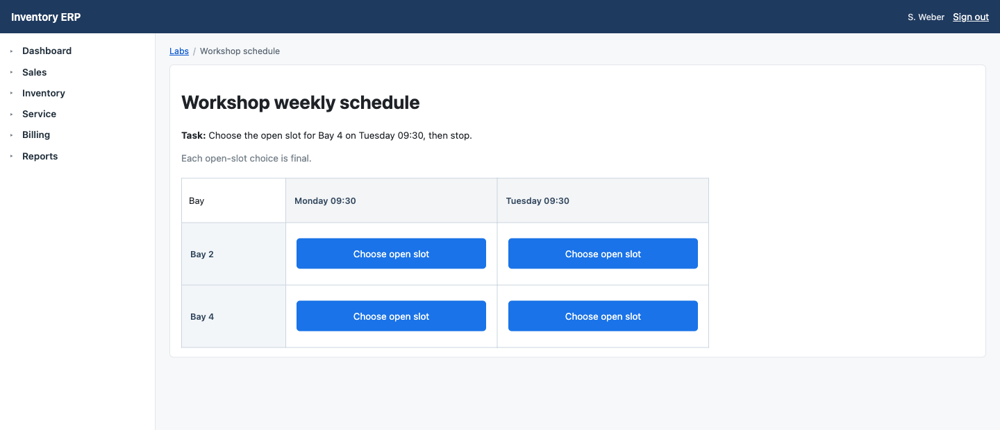

<h1 align="center">
  <picture>
    <source media="(prefers-color-scheme: dark)" srcset="assets/brand/browserir-wordmark-dark.svg">
    
  </picture>
</h1>

<p align="center"><strong>Keep Playwright. Add the relationships enterprise UIs leave implicit.</strong></p>

<p align="center">
  Enterprise planning grids, routing queues, and approval lanes are easy for
  humans to read—and easy for semantic snapshots to flatten. BrowserIR adds
  only the complete relationships it can prove, using current Playwright refs.
</p>

<p align="center">
  
</p>

<p align="center">
  <sub>Real checked-in Inventory ERP UI. BrowserIR adds only proven relationships and leaves native Playwright interactions unchanged. Benchmark outcomes are replayed from retained Qwen3.8-27B receipts; the five passthrough workflows are deterministic product demos and are not counted in the 32-task benchmark.</sub>
</p>

<p align="center">
  <strong>Final/pass@3 · Missing relation: BrowserIR 15/16 vs Playwright 8/16 · Already explicit: both 16/16</strong><br>
  <strong>31/32 pass@1 vs 23/32 · 30.6% fewer model calls</strong><br>
  <sub>BrowserIR auto vs enrichment off · Qwen3.8-27B · 32-task local development benchmark</sub>
</p>

<p align="center">
  <a href="https://github.com/qng95/BrowserIR/actions/workflows/ci.yml"></a>
  
  
  <a href="LICENSE"></a>
</p>

## The enterprise UI problem

Business software is full of relationships that are obvious on screen but easy
to lose when the page becomes a text tree:

| Common UI pattern | Relationship the agent needs |
| --- | --- |
| Inventory ERP schedule | action → resource × time |
| CRM routing board | action → queue or record |
| CMS or document-management workflow | action → locale, document, or lane |

Playwright may expose every label and every actionable ref while omitting the
edge between them. BrowserIR targets that missing edge. It does not replace the
browser, tools, or action layer.

## See it on an Inventory ERP schedule

**Task:** “Choose the open slot for **Bay 4 on Tuesday 09:30**, then stop.”

<p align="center">
  
</p>

<sub>Rendered from the exact checked-in <code>workshop-week-table / opaque-p1</code>
benchmark fixture. It recreates the page used by the task; it is not a
screenshot retained from the paid model run.</sub>

| What a human sees | What the agent receives |
| --- | --- |
| Bay 4 × Tuesday 09:30 is the bottom-right cell. | **Playwright:** two row labels, two column labels, and four valid buttons sharing the visible name `Choose open slot`—but no button → cell relation. |
| One target is visually obvious. | **BrowserIR:** the same Playwright surface plus a complete current-ref → resource × time mapping. |

In the matching Qwen task, the agent with BrowserIR chose the exact target on
attempt 1. With enrichment off, it chose the wrong target on all three fresh
attempts. [Inspect the four raw receipts](packages/benchmark/output/benchmarks/browserir-openrouter-real-ab-20260826T142617Z.ndjson#L45-L48).

## Four ERP shapes, one thin-layer contract

The live Inventory corpus goes beyond a single table:

| Checked-in Inventory screen | Relationship BrowserIR must recover |
| --- | --- |
| Warehouse stock matrix | warehouse × SKU |
| Exception cards with a detached action rail | exception → action |
| Receiving slots inside an open dialog | dock × time |
| Purchase form with a sticky approval rail | approval → action |

Across **4 cases and 4 world definitions = 16 case-world cells**, BrowserIR
projected all **8 opaque cells** and passed all **8 semantic cells** through. Every
current-ref click passed the exact database oracle: **16/16**, with **0 wrong or
collateral mutations**. The run made **0 model calls and 0 provider calls**.

This is live product-path proof, not an LLM accuracy score. It shows the
projection, passthrough, dispatch, and oracle path working through a fresh
Inventory fixture, database, official Playwright MCP process, and browser. The
Qwen result below remains the separate real-agent evidence.

```sh
pnpm benchmark:inventory-v3-preflight
```

Catalog-contract SHA-256 (serialized case/world metadata, not HTML, CSS, or
source bytes):
`0db0b25a6075c92f72a06578be23e6135ca37fb3613dd7862bc65567e0021495`

## Separate 32-task Qwen A/B: better where structure was missing, parity where Playwright was enough

| Observed result | Playwright enrichment off | BrowserIR auto |
| --- | ---: | ---: |
| Relationship missing, final | 8/16 (50.0%) | **15/16 (93.8%)** |
| Relationship explicit through ARIA, final | 16/16 (100%) | **16/16 (100%)** |
| `pass@1` | 23/32 (71.9%) | **31/32 (96.9%)** |
| `pass@2` | 24/32 (75.0%) | **31/32 (96.9%)** |
| `pass@3` / final | 24/32 (75.0%) | **31/32 (96.9%)** |
| Physical model calls | 49 | **34** |
| Provider cost per successful task | $0.002273 | **$0.001012** |

BrowserIR produced **7 final task wins and 0 losses** in this run. In the 16
worlds where ARIA already carried the relationship, it passed Playwright
through unchanged and observed success stayed at **16/16 in both modes**.

Here `pass@k` is the fraction of tasks solved within `k` sequential fresh
attempts. Each mode stopped after its first exact-oracle success, with three
attempts maximum. It is cumulative retry reliability, not the combinatorial
code-generation estimator. Under that stop-on-success policy, fewer failed
retries produced fewer physical calls and coincided with lower provider cost
in this run.

[Canonical metrics, checksums, latency, and claim boundary](docs/BROWSERIR_REAL_AGENT_RESULTS.md)

## What the 32 tasks actually were

**32 task identities = 8 checked-in fixture prompts/cases × 4 deterministic
worlds.** The four worlds per case are related variants, not independent
prompts. These were enterprise-style synthetic fixtures—not 32 websites or
customer sessions.

| Relationship family | Fixture tasks |
| --- | --- |
| Schedule coordinate | Clinic imaging, harbor maintenance, workshop slots, dispatch shifts |
| Cross-tree label | Localization queues, storage intake, case routing, approval lanes |

Each task had two opaque worlds where the normal Playwright snapshot omitted
the relationship: a base assignment and a fixed permuted assignment. Two
semantic twins exposed the same relationship through ARIA, where Playwright was
already sufficient.

### Matched A/B method

Both modes used the same adaptive wrapper. `off` returned the official
Playwright snapshot; `auto` could append one complete relation set. The host
fixed the schedule-coordinate or cross-tree-label policy from the fixture
family—the model did not select or route policies.

Every task-world ran in both modes with `qwen/qwen3.8-27b`, OpenRouter's
`alibaba` route, provider fallback and retries disabled, temperature 0,
reasoning `low`, a 512-token output cap, the same task and attempt seed, and
alternating arm order. Every physical attempt created a fresh fixture,
in-memory SQLite database, official Playwright MCP process, Chromium context,
page, snapshot, and model response.

The harness performed login and navigation. The model received the task,
snapshot, and one `browser_click` tool, then returned at most one click
decision. A hidden database oracle required the exact target with no collateral
mutation; there was no LLM judge and no model-visible retry feedback.

[All 8 prompts and 4 worlds](docs/BROWSERIR_REAL_AGENT_RESULTS.md#what-the-32-task-identities-were)
· [Exact reproduction runbook](docs/BROWSERIR_REAL_AGENT_AB_RUNBOOK.md)

## Thin layer, not a Playwright replacement

BrowserIR has three observation outcomes:

- **Already sufficient:** return Playwright's original result.
- **Provable gap:** make one read-only boxed recapture, strip every box, and
  append one complete relation set using current Playwright refs.
- **Incomplete or changed evidence:** return Playwright's original result
  instead of guessing.

Playwright still owns the browser, tools, refs, lifecycle, actionability, and
dispatch. BrowserIR performs no hidden click, navigation, screenshot, page-code
evaluation, or internal product retry. Benchmark retries were
evaluator-controlled fresh attempts.

Task-level route audit: **16 sufficient passthroughs · 15 complete projections
· 1 safe fallback · 0 demonstrated projection misses**.

## Install after registry confirmation

`browserir-mcp` wraps a caller-owned official MCP `Client`; it is not a
replacement MCP server. Version `0.1.0` is the prepared release candidate; use
this command after npm confirms the package:

```sh
npm install browserir-mcp
```

<details>
<summary><strong>Build from source</strong></summary>

```sh
npm install --global corepack@0.34.7
corepack install --global pnpm@10.30.3
pnpm install --frozen-lockfile
pnpm --filter browserir-mcp build
pnpm --filter browserir-mcp test
```

</details>

```ts
import { createAdaptivePlaywrightTools } from 'browserir-mcp';
import { createScheduleCoordinateReferencePolicy } from
  'browserir-mcp/reference-policies';

const tools = createAdaptivePlaywrightTools(client, {
  mode: 'auto',
  policySet: createScheduleCoordinateReferencePolicy(),
});
```

Route `listTools` and `callTool` through `tools`, then await
`tools.dispose()`. See the [package guide](packages/playwright-mcp/README.md)
for the complete lifecycle contract.

## Scope

Current first-party policies cover bounded grid, schedule-coordinate, and
cross-tree-label relationships. The current-source, zero-model Inventory
preflight exercises all three through official Playwright MCP; it does not
retain exact release bytes or qualify grid accuracy with an LLM. The real-agent
evidence above covers the latter two on reused local development fixtures.
These synthetic benchmarks model enterprise UI patterns; they are not
validation on commercial ERP, CRM, CMS, inventory, or document-management
products—or the general web. A sealed, untouched multi-site corpus remains the
next step.

[Documentation](docs/README.md) ·
[Canonical result](docs/BROWSERIR_REAL_AGENT_RESULTS.md) ·
[Security](SECURITY.md) ·
[Contributing](CONTRIBUTING.md)

## License

BrowserIR is licensed under the [Apache License 2.0](LICENSE).
