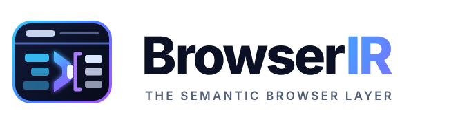
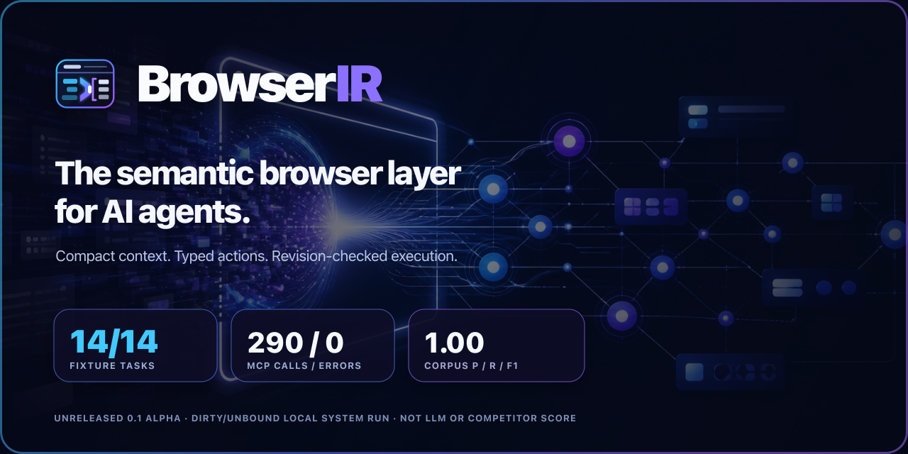

# BrowserIR brand and press kit

  <picture>
    <source media="(prefers-color-scheme: dark)" srcset="browserir-wordmark-dark.svg">
    
  </picture>

  

This folder contains the visual and messaging assets for BrowserIR's `0.1`
alpha launch. The identity is built around one idea: irregular browser controls
pass through a compile gate and emerge as a compact, structured representation.

## Assets

| Asset | Use |
| --- | --- |
| [`browserir-mark.svg`](browserir-mark.svg) | Primary standalone Compile Gate mark. |
| [`browserir-mark-mono.svg`](browserir-mark-mono.svg) | One-color mark for print, engraving, and constrained surfaces. |
| [`browserir-wordmark.svg`](browserir-wordmark.svg) | Horizontal wordmark for light backgrounds. |
| [`browserir-wordmark-dark.svg`](browserir-wordmark-dark.svg) | Horizontal wordmark for dark backgrounds. |
| [`browserir-hero.png`](browserir-hero.png) | Cinematic text-free README and launch hero. |
| [`browserir-benchmark.svg`](browserir-benchmark.svg) | Exact local qualification scorecard. |
| [`browserir-scoring-method.svg`](browserir-scoring-method.svg) | Plain-English visual showing how a task earns a pass. |
| [`browserir-representation.svg`](browserir-representation.svg) | Product visual showing a live UI compiled into model-ready IR. |
| [`browserir-architecture.svg`](browserir-architecture.svg) | High-level product architecture visual. |
| [`browserir-social-card.png`](browserir-social-card.png) | 1280 × 640 social and repository preview card. |
| [`PRESS_KIT.md`](PRESS_KIT.md) | Launch headlines, descriptions, facts, FAQ, and social copy. |

PNG exports of every vector visual are provided for contexts that do not support
SVG. Use `browserir-social-card.png` as the repository Open Graph image when the
project is published.

## What the mark means

The left side is the rendered browser UI: useful, but irregular. The central
gate is BrowserIR compiling and reconciling that interface. The bracketed rows
on the right are the compact structured representation an agent receives. The
symbol is deliberately a transformation, not an abstract AI graph.

## Palette

| Name | Hex | Role |
| --- | --- | --- |
| Midnight | `#070A18` | Primary dark background. |
| Ink | `#0B1025` | Cards and browser surfaces. |
| Electric blue | `#4F7CFF` | Primary interaction color. |
| Signal cyan | `#38BDF8` | Evidence and input accents. |
| Semantic violet | `#9B5CFF` | Relationships and IR accents. |
| Cloud | `#F8FAFC` | High-contrast copy. |

## Approved launch copy

### One line

BrowserIR is the semantic browser layer for AI agents that must get real work
done.

### Short description

BrowserIR uses Playwright for browser mechanics and turns live enterprise UIs
into compact semantic entities, relationships, available actions, revisions,
and observed effects with verification status. Use it as a TypeScript core or a
local MCP server.

### Boilerplate

BrowserIR is an interaction representation and runtime for AI browser agents.
It is designed for complex operational software such as ERP, CRM, and DMS. Its
tested slices include standards-hinted custom controls, open Shadow DOM,
same-origin frames, virtualized grids, delayed content, and legacy full-page
postbacks. BrowserIR keeps selectors below the model boundary, exposes typed
revision-checked actions, reports omissions, and uses Playwright for browser
execution.

## Benchmark language

Use this exact scoped formulation:

> In a local deterministic qualification, BrowserIR completed 14/14 controlled
> fixture tasks through real Chromium and the official MCP client, using 299
> MCP calls with zero tool errors. A separate checked-in representation corpus
> matched 31 entities, 44 capabilities, and 28 relationships without errors in
> that corpus. These are dirty/unbound local engineering results, not qualified
> release evidence or an immutable public baseline, and not an LLM or competitor
> score.

Do not use `100% agent success`, `production-ready`, `fastest`, `most compact`,
or superiority claims until paired, reproducible model and competitor results
exist.

## Logo usage

- Preserve clear space equal to one structured-record height around the mark.
- Prefer the color mark on midnight, white, or very pale blue backgrounds; use
  the monochrome mark where gradients or tonal contrast are unavailable.
- Keep the three-part story intact: irregular UI controls, the central compile
  gate, and the bracketed structured records.
- Do not replace the gate with a generic play button, remove the browser rail,
  add effects, rotate the mark, or place copy inside it.
- Use the wordmark when the audience may not already know the BrowserIR name.

The generated hero is intentionally text-free so launch copy can change without
regenerating the art. The scorecard and system diagram are deterministic SVGs so
their labels and metrics remain exact.
